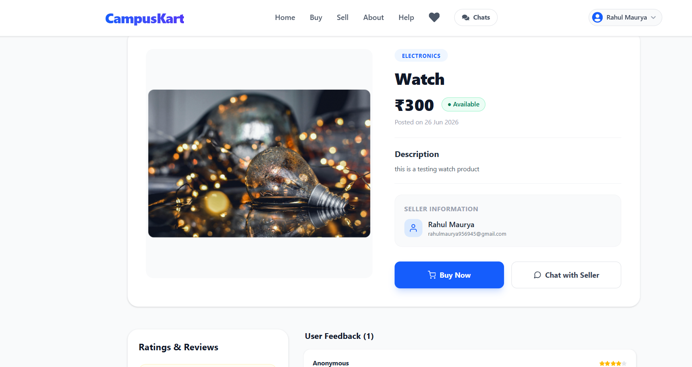
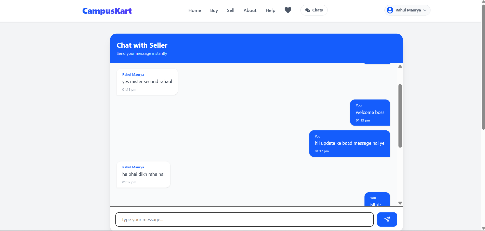
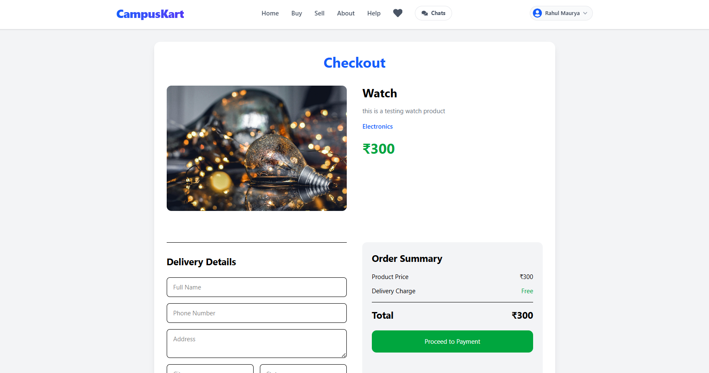

# 🎓 CampusKart

CampusKart is a full-stack MERN-based marketplace designed for college students to buy, sell, and chat about second-hand products within their campus community.

---

## 🚀 Live Demo

🌐 Frontend: https://campus-kart-iota.vercel.app

🌐 Backend API: https://campuskart-546k.onrender.com

---

## ✨ Features

- 👤 User Authentication (JWT + Email OTP Verification)
- 📦 Add, Edit & Delete Products
- 🔍 Search & Browse Products
- ❤️ Wishlist Management
- 💬 Real-Time Chat using Socket.IO
- ⭐ Product Reviews & Ratings
- 🛒 Checkout & Order Management
- 💳 Razorpay Payment Integration (Test Mode)
- ☁️ Cloudinary Image Upload
- 📱 Responsive UI
- 🔒 Protected Routes
- 📧 Email Verification using Brevo API

---

## 🛠️ Tech Stack

### Frontend

- React.js
- React Router
- Axios
- Tailwind CSS
- React Toastify
- Socket.IO Client

### Backend

- Node.js
- Express.js
- MongoDB
- Mongoose
- JWT Authentication
- Socket.IO
- Razorpay
- Cloudinary
- Brevo Email API

---

## 📂 Project Structure

```
CampusKart
│
├── frontend
│   ├── components
│   ├── pages
│   ├── api
│   └── assets
│
└── backend
    ├── controllers
    ├── models
    ├── routes
    ├── middleware
    ├── utils
    └── config
```

---

## ⚙️ Environment Variables

### Backend

```env
PORT=

MONGO_URI=

JWT_SECRET=

BREVO_API_KEY=

SENDER_EMAIL=

CLOUDINARY_CLOUD_NAME=
CLOUDINARY_API_KEY=
CLOUDINARY_API_SECRET=

RAZORPAY_KEY_ID=
RAZORPAY_KEY_SECRET=
```

### Frontend

```env
VITE_API_URL=
VITE_SOCKET_URL=
VITE_RAZORPAY_KEY_ID=
```

---

## 💻 Installation

### Clone Repository

```bash
git clone https://github.com/yourusername/CampusKart.git
```

### Backend

```bash
cd backend

npm install

npm run dev
```

### Frontend

```bash
cd frontend

npm install

npm run dev
```

---


## 📸 Screenshots

### Home Page


### Product Details



### Chat



### Checkout




## 🎯 Future Improvements

- AI Product Recommendations
- AI Chat Assistant
- Campus Verification
- Seller Dashboard
- Payment Settlement
- Order Tracking
- Notifications
- Admin Panel
- Dark Mode

---

## 👨‍💻 Developed By

**Rahul Maurya**

GitHub: https://github.com/RahulMaurya90058

LinkedIn:https://linkedin.com/in/rahul-maurya-16b957312


This project is developed for educational and learning purposes.

⭐ If you like this project, don't forget to star the repository.
